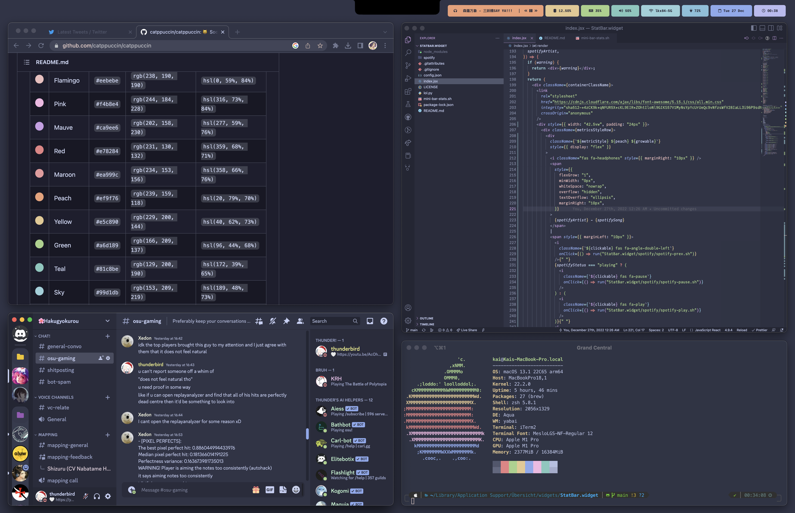

# uber-menubar

## My current bar for Übersicht

- Derived off of [Statbar](https://github.com/mclarence/StatBar) by [mclarence](https://github.com/mclarence)
- Designed inspired by [rayh4444n's](https://www.reddit.com/user/rayh4444n) [Mocha](https://www.reddit.com/r/unixporn/comments/zos11o/hyprland_mocha/) setup found on /r/unixporn
- Uses the [Catppuccin](https://github.com/catppuccin/catppuccin) Frappé theme

---

### todo:

- Escape characters properly in Spotify artist/song names
- See if I can programmatically generate colours along the catppuccin palette instead of having to manually declare it for each new tile I create
- Workspaces
